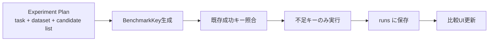
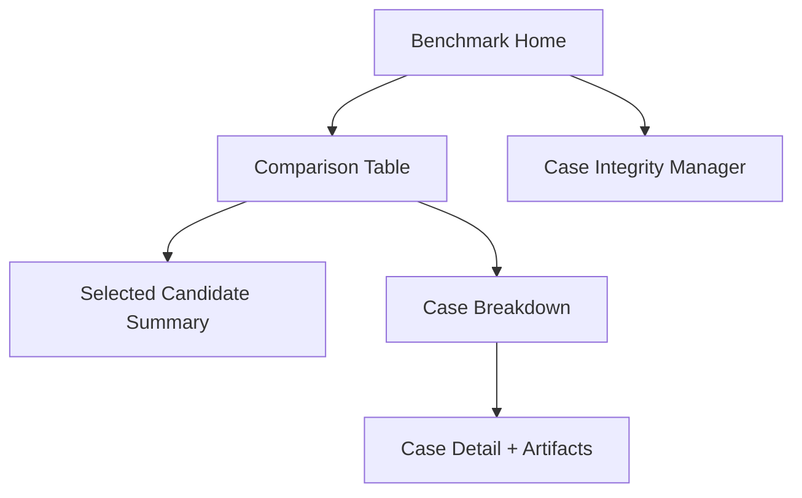

# Benchmark Comparison Spec (Draft)

更新日: 2026-02-12
ステータス: Draft（議論内容を反映した仕様たたき台）

## 1. 目的の再定義

- ベンチマークは「意思決定」のために使う。
- 健全性確認（壊れていないかの確認）はベンチマークではなく `Regression Check` として分離する。
- 主用途は「複数候補（model/prompt/options）を同条件で比較し、採用判断すること」。

## 2. 現在実装の整理（事実）

- 現行は `manual_test_cases.jsonl` を共通入力として、`stt/generation/vision` を個別実行する。
- 1回の実行は「1 kind × 1設定 × Nケース」。
- kindごとに参照する入力フィールドが異なるため、実効的な評価対象ケース集合は異なる（不足フィールドは skipped）。

## 3. kindごとの入力仕様（現状 + 方針）

| kind | 主入力 | 参照正解 | 現状 | 方針 |
|---|---|---|---|---|
| stt | `audio_file` | `labels.transcript_gold` 優先 | 実装済み | 維持 |
| generation | `stt_text`（不足時に transcript系へフォールバック） | `ground_truth_text` 優先 | 実装済み | `stt_text` 必須化（不足時は skipped） |
| vision | `vision_image_file` | `context.visionSummary/visionTerms` | 実装済み | 維持 |

## 4. Candidate の定義

`candidate` はキャッシュ本体ではなく、比較対象を識別するための定義データ。
同一 candidate + 同一 dataset + 同一 options なら、結果再利用の判定キーに使える。

```ts
type Candidate = {
  candidate_id: string;        // 例: deepgram_stream_120_v1
  task: "stt" | "generation" | "vision";
  model: string;               // 例: deepgram_stream / apple_speech_recognizer_stream / gemini-2.5-flash-lite
  prompt_profile_id?: string;  // generation の場合
  options: {
    chunk_ms?: number;
    silence_ms?: number;
    max_segment_ms?: number;
    pre_roll_ms?: number;
    realtime?: boolean;
    require_context?: boolean;
    llm_eval?: boolean;
  };
  note?: string;
};
```

## 5. BenchmarkKey の定義

`BenchmarkKey` は「比較セル」を一意に識別するキー。

```ts
type BenchmarkKey = {
  task: "stt" | "generation" | "vision";
  dataset_snapshot_id: string;  // 固定ケース集合
  candidate_id: string;         // 比較対象
  runtime_options_hash: string; // 実行条件ハッシュ
  evaluator_version: string;    // 評価ロジックの版
  code_version: string;         // 実装版（git sha など）
};
```

## 6. 保存モデル（提案）

```text
benchmarks/
├── datasets/
│   └── <dataset_snapshot_id>/
│       ├── manifest.json
│       └── cases.jsonl
├── candidates/
│   └── <candidate_id>.json
└── runs/
    └── <run_id>/
        ├── manifest.json        # benchmark_key を含む
        ├── cases.jsonl
        ├── events.jsonl
        └── artifacts/
```

## 7. 実行フロー（提案）



## 8. UI 方針（比較ファースト）

### 8.1 画面構成（提案）



### 8.2 比較画面の要件

- メインは `candidate` 行の比較表（精度 / latency / cost / Δbaseline）。
- baselineを固定し、差分指標を標準表示。
- 指標からケース詳細へドリルダウンできる（悪化ケース順）。

### 8.3 ケース不備管理画面（Case Integrity Manager）

- 目的: 「実行不能ケース」「必須フィールド欠落ケース」を一覧管理する。
- 表示対象例:
  - `generation`: `stt_text` 欠落
  - `stt`: `audio_file` 欠落・読込不能
  - `vision`: `vision_image_file` 欠落
  - 参照正解欠落
- 操作案:
  - 絞り込み（kind/不備種別）
  - ケース詳細表示
  - 修正導線（対象 run を開く、該当ファイルを開く）
  - 除外フラグ付け（ベンチ対象外）

## 9. 直近で合意した変更方針

1. Generation ベンチは `stt_text` を必須とする。
2. `stt_text` がないケースは `skipped_missing_input_stt` として扱う（フォールバックしない）。
3. ベンチ画面は「run中心閲覧」から「candidate比較中心閲覧」へ移行する。

## 10. 未決事項

1. `candidate` に含める範囲（modelのみ / prompt / temperature まで）
2. データセットの公式分割（core/hard/smoke）
3. 採用判定ゲート（精度・遅延・コストの重み）
4. vision を比較本流に含めるか、最終確認枠にするか
